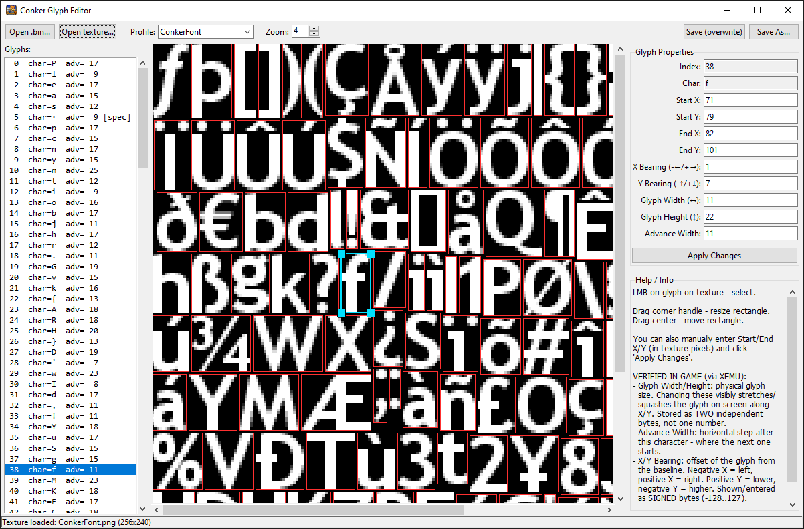

[badge-en]: https://img.shields.io/badge/lang-English%20%F0%9F%87%AC%F0%9F%87%A7-white
[badge-ru]: https://img.shields.io/badge/%D1%8F%D0%B7%D1%8B%D0%BA-%D0%A0%D1%83%D1%81%D1%81%D0%BA%D0%B8%D0%B9%20%F0%9F%87%B7%F0%9F%87%BA-white
[vot-readme-en]: README.md
[vot-readme-ru]: README_RU.md
[![en][badge-en]][vot-readme-en]
[![ru][badge-ru]][vot-readme-ru]

<table>
<tr>
<td width="170">

<p>
  
</p>

</td>
<td>

# Conker Glyph Editor

### A visual glyph editor for Conker: Live & Reloaded fonts (CAFF format).

</td>
</tr>
</table>

## Files

- `conker_glyph_format.py` — library for reading and writing the font format (required by the editor)
- `conker_glyph_editor.py` — the main graphical editor (tkinter)

All files must be located in the same folder.

## Screenshot

<p align>
  
</p>

## Installation (Windows)

### Option 1 — Download the executable

Download the latest `.exe` version from the [Releases](https://github.com/AS97GitHub/Conker-Glyph-Editor/releases) page.

> No `python` installation or additional dependencies are required.

### Option 2 — Run from source

1. Make sure Python 3.8 or later is installed (tkinter is included with the standard Windows Python distribution, so no separate installation is required).
2. Install Pillow:
   ```
   pip install Pillow
   ```

## Running

> ⚠️ On Windows, you can use either `python` or `py` to run the script, depending on your Python installation.

> ⚠️ On Linux you may need to use `python3` instead of `python`.

```bash
python conker_glyph_editor.py
```

Or launch it directly with the font and texture files:

```bash
python conker_glyph_editor.py path\to\default.bin path\to\texture.png
```

## Usage

1. **"Open .bin..."** — select a font file (for example, `default.bin` from `ConkerFont`). The **profile** (`ConkerFont` / `ConkerFontJapanese` / `FrontendTitle` / `FrontendTitleJapanese`) is **detected automatically** from a byte signature in the file and the drop-down updates to match; you only need to pick a profile manually if you want to override the detected one (e.g. to experiment, or if detection fails on an unusual file).
2. **"Open Texture..."** — select the extracted texture for the same font (BMP or PNG, for example one extracted with CrystalTile2, ImageHeat, or your own export).
3. The glyph list on the left lets you select a glyph — it also shows the character each glyph maps to (see **"Character mapping"** below), when known. The selected glyph is highlighted on the texture with a light blue rectangle and corner handles.
4. **Editing:**
   - Drag a corner handle to resize the glyph rectangle (`x0/y0/x1/y1`).
   - Drag the center of the rectangle to move it.
   - Alternatively, enter values manually in the panel on the right and click **"Apply Changes"**.
   - Besides the rectangle, the panel also exposes four additional per-glyph fields, confirmed in-game (via XEMU) to affect rendering:
     - **X Bearing / Y Bearing** — the glyph's offset from the baseline (negative X = left, positive X = right; positive Y = lower, negative Y = higher). Shown as signed values (-128..127).
     - **Glyph Width / Glyph Height** — the physical on-screen size of the glyph; changing these stretches or squashes it along that axis, independently of the texture rectangle size.
     - **Advance Width** — the horizontal step to the next character's starting position.
5. **Saving:**
   - **"Save As..."** — save to a new file (recommended to preserve the original).
   - **"Save (overwrite)"** — overwrite the currently opened file (confirmation required).

The editor modifies **only the bytes of the selected glyph record**: each record occupies an 18-byte slot in the glyph table, but the editor only reads/writes the first 16 bytes of that slot, which is where all the fields above live (including a last byte, always observed as 0x00). The remaining 2 bytes of each 18-byte slot are a **separate area that the editor never reads or writes at all**. Across all four sample files (`ConkerFont`, `ConkerFontJapanese`, `FrontendTitle`, `FrontendTitleJapanese` — 1,879 glyph records combined), these 2 bytes are `FF FF` in every single record with no exceptions. That said, this is an observation across the sample files checked, not a confirmed fact about the format — its actual purpose (if any) is unknown. They are left untouched to avoid corrupting something that hasn't been fully investigated. The rest of the file (texture, other glyphs, headers, etc.) remains completely unchanged at the byte level.

## Character mapping

The editor automatically scans the file for its character-to-glyph mapping table (no hardcoded offsets), so it works across fonts with different sizes and layouts, including the CJK variants (`ConkerFontJapanese`, `FrontendTitleJapanese`). This is what populates the character shown next to each glyph in the list. This mapping is read-only in the GUI; the underlying library (`conker_glyph_format.py`) additionally exposes `remap_charmap_code()` and `find_codes_in_range()` for programmatically reassigning which character code triggers a given glyph, if you need that for a script-based workflow.

## Important Note

The coordinate decoding formula for each font is:

```
pixel = raw / DIV + OFFSET
DIV   = 16384 / actual_used_texture_size_in_pixels
```

where 16384 = 2¹⁴ — coordinates are stored in a fixed 14-bit normalized grid.

The **"actual used size"** is the real width/height of the texture's content (for example what ImageHeat produces after trimming empty padding: 256×240 for `ConkerFont`, 512×203 for `FrontendTitle`), not the power-of-two file dimensions of the texture.

This formula has been validated via **IoU** against the real textures of the known fonts (~0.85–0.87 average overlap between predicted and actual glyph outlines) and gives a single, structurally consistent logic for both X and Y, rather than two independently fitted numbers.

However: the coordinate formula itself has **not been fully verified through disassembly/debugging of the game's own code** — a discrepancy with what the actual engine uses is still theoretically possible, especially for texture sizes not yet covered by the tested samples. This caveat applies specifically to the texture-rectangle (`x0/y0/x1/y1`) formula; the other editable fields (X/Y Bearing, Glyph Width/Height, Advance Width) are separately **confirmed in-game via XEMU**, by editing one field at a time and comparing screenshots against an unmodified baseline.

If possible, verify your changes in the actual game (for example, using XEMU). It is recommended to make small edits and test them before relying on the editor for large-scale modifications.
