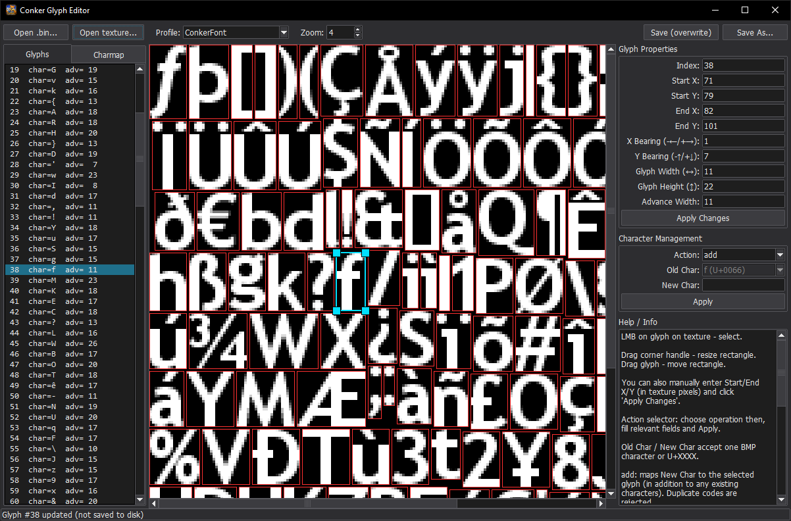

<table>
<tr>
<td width="170">

<p>
  
</p>

</td>
<td>

# Conker Glyph Editor

### A visual glyph editor for Conker: Live & Reloaded fonts (CAFF format).

</td>
</tr>
</table>

## Files

- `conker_glyph_format.py` — library for reading and writing the font format and managing open-addressed character maps (required by the editor)
- `conker_glyph_editor.py` — the main graphical editor (tkinter)

All files must be located in the same folder.

## Screenshot

<p align>
  
</p>

## Installation (Windows)

### Option 1 — Download the executable

Download the latest `.exe` version from the [Releases](https://github.com/AS97GitHub/Conker-Glyph-Editor/releases) page.

> No `python` installation or additional dependencies are required.

### Option 2 — Run from source

1. Make sure Python 3.8 or later is installed (tkinter is included with the standard Windows Python distribution, so no separate installation is required).
2. Install Pillow:
   ```
   pip install Pillow
   ```

## Running

> ⚠️ On Windows, you can use either `python` or `py` to run the script, depending on your Python installation.

> ⚠️ On Linux you may need to use `python3` instead of `python`.

```bash
python conker_glyph_editor.py
```

Or launch it directly with the font and texture files:

```bash
python conker_glyph_editor.py path\to\default.bin path\to\texture.png
```

## Usage

1. **"Open .bin..."** — select a font file (for example, `default.bin` from `ConkerFont`). The **profile** (`ConkerFont` / `ConkerFontJapanese` / `FrontendTitle` / `FrontendTitleJapanese`) is **detected automatically** from a byte signature in the file and the drop-down updates to match; you only need to pick a profile manually if you want to override the detected one.
2. **"Open Texture..."** — select the extracted texture for the same font (BMP or PNG, for example one extracted with CrystalTile2, ImageHeat, or your own export).
3. **Glyphs / Charmap Tabs:** Select a glyph by its index or search assigned characters in the Charmap tab. The selected glyph is highlighted on the texture with a light blue rectangle and corner handles.
4. **Visual & Property Editing:**
   - Drag a corner handle to resize the glyph rectangle (`x0/y0/x1/y1`).
   - Drag the center of the rectangle to move it.
   - Manually edit metrics on the right panel and click **"Apply Changes"**:
     - **X Bearing / Y Bearing** — baseline offset (signed -128..127).
     - **Glyph Width / Glyph Height** — physical on-screen size (rescales the glyph on screen).
     - **Advance Width** — horizontal step to the next character.
5. **Character Management:** Select an action from the menu and click **"Apply"**:
   - **add** — map a new character or code point (e.g., `U+0410` or a single symbol) to the selected glyph.
   - **remove** — delete a character alias assigned to the glyph.
   - **replace** — reassign an existing character mapping to point to a new code point.
   - **clear_glyph** — wipe all charmap entries pointing to the glyph and zero out its metrics/rectangle data.
6. **Saving:**
   - **"Save As..."** — save to a new file.
   - **"Save (overwrite)"** — overwrite the open file.

The editor safely modifies the glyph records and rebuilds the fixed 2048-slot hash table without interrupting probe chains or corrupting unrelated file regions.

## Extracting the texture with CrystalTile2

To open the font texture in **CrystalTile2**:

1. Open the font file in CrystalTile2.
2. Use the following settings:

**Default setting**

* **Offset:**

  * `3458` — `ConkerFont`
  * `79F8` — `ConkerFontJapanese`
  * `2EFC` — `FrontendTitle`
  * `407C` — `FrontendTitleJapanese`

**Tile property**

* **Width / Height:**

  * `256×240` — `ConkerFont`
  * `1024×772` — `ConkerFontJapanese`
  * `512×203` — `FrontendTitle`
  * `1024×335` — `FrontendTitleJapanese`

* **Tile form:** `GBA 8bpp`

**Palette**

* **Palette:** `Gray DIVISION`

3. After applying these settings, export the texture as a **BMP** or **PNG** file.
4. Open the exported texture in **Conker Glyph Editor** using **"Open Texture..."**.

> **Tip:** For editing the texture, it is recommended to copy it directly from the CrystalTile2 preview and paste it into Photoshop. This preserves the texture's appearance as displayed in CrystalTile2.

## Important Note

The coordinate decoding formula for each font is:

```
pixel = raw / DIV + OFFSET
DIV   = 16384 / actual_texture_size_in_pixels
```

where 16384 = 2¹⁴ — coordinates are stored in a fixed 14-bit normalized grid.

The texture rectangle coordinate formula (`x0/y0/x1/y1`) is derived empirically, while rendering properties (**X/Y Bearing**, **Glyph Width/Height**, and **Advance Width**) are separately **confirmed in-game via XEMU**. Verify your changes in-game when doing large-scale modifications.
