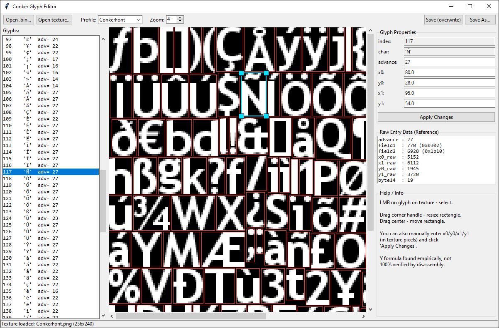

# Conker Glyph Editor

🇺🇸 [English](README.md) | 🇷🇺 Русский

⚠ Исходный код на ранней стадии разработки

Визуальный редактор глифов для шрифтов Conker: Live & Reloaded (формат CAFF).

## Файлы

- `conker_glyph_format.py` — библиотека чтения/записи формата (нужна для работы редактора)
- `conker_glyph_editor.py` — сам редактор с графическим интерфейсом (tkinter)

Оба файла должны лежать в одной папке.

## Скриншот
<p align="center">
  
</p>

## Установка (Windows)

1. Убедитесь, что у вас установлен Python 3.8+ (tkinter входит в стандартную поставку Python для Windows, отдельно ставить не нужно).
2. Установите Pillow:
   ```
   pip install Pillow
   ```

## Запуск

> ⚠️ На Windows можно использовать `python` или `py`, в зависимости от того, как у вас установлен Python.

> ⚠️ На Linux вместо `python` может понадобиться `python3`.

```bash
python conker_glyph_editor.py
```

Либо сразу с файлами:

```bash
python conker_glyph_editor.py путь\к\default.bin путь\к\текстуре.png
```

## Как пользоваться

1. **"Open .bin..."** — выберите файл шрифта (например `default.bin` из `ConkerFont`).
2. **"Open Texture..."** — выберите извлечённую текстуру этого же шрифта (BMP или PNG, например то, что получили через CrystalTile2, ImageHeat или ваш собственный экспорт).
3. Выберите правильный **профиль** в выпадающем списке (`ConkerFont` / `ConkerFontJapanese` / `FrontendTitle` / `FrontendTitleJapanese`) — это готовый набор калибровочных коэффициентов, уже подобранный для конкретного шрифта (см. "Важная оговорка" ниже). Никакой интерактивной калибровки в интерфейсе нет — просто выберите профиль, соответствующий открытому шрифту.
4. Список глифов слева — клик выбирает глиф, он подсвечивается на текстуре голубой рамкой с ручками по углам.
5. **Редактирование:**
   - тащите мышью за угол рамки — меняете размер (`x0/y0/x1/y1`).
   - тащите за середину — двигаете весь прямоугольник целиком.
   - либо впишите числа вручную в панели справа и нажмите **"Apply Changes"**.
   - поле `advance` — ширина шага курсора при рендере текста, тоже редактируется вручную.
6. **Сохранение:**
   - **"Save As..."** — сохранить в новый файл (рекомендуется, чтобы не потерять оригинал).
   - **"Save (overwrite)"** — перезаписать открытый файл (спросит подтверждение).

Редактор меняет **только байты конкретной записи глифа** (18 байт на глиф) — вся остальная структура файла (текстура, другие глифы, заголовки) остаётся побайтово нетронутой.

## Важная оговорка

Формула распаковки координат для каждого шрифта:

```
pixel = raw / DIV + OFFSET
DIV   = 16384 / реальный_используемый_размер_текстуры_в_пикселях
```

где 16384 = 2¹⁴ — координаты хранятся в фиксированной 14-битной нормализованной сетке.
"Реальный используемый размер" — это фактическая ширина/высота содержимого текстуры
(например то, что отдаёт ImageHeat при обрезке пустых полей: 256×240 для ConkerFont,
512×203 для FrontendTitle), а не округлённый до степени двойки размер файла текстуры.

Эта формула подтверждена по IoU против реальных текстур известных шрифтов (~0.85–0.87
среднего совпадения контуров букв) и даёт для X и Y единую структурную логику, а не
подогнанные по отдельности числа. Но: она **не проверена через дизассемблирование/отладку
кода самой игры на 100%** — расхождение с тем, что использует реальный движок, всё ещё
теоретически возможно, особенно для нестандартных размеров текстур, которые ещё не
встречались в проверенных образцах.

Если у вас есть возможность проверить результат в реальной игре (например через XEMU) —
рекомендуется делать небольшие правки и проверять их в игре, прежде чем полагаться на
редактор для масштабных изменений.

## Формат данных, с которым работает библиотека

Подробное описание формата CAFF-контейнера, таблицы глифов и таблицы символ→глиф —
см. сопроводительную документацию проекта и переписку с описанием реверс-инжиниринга.
